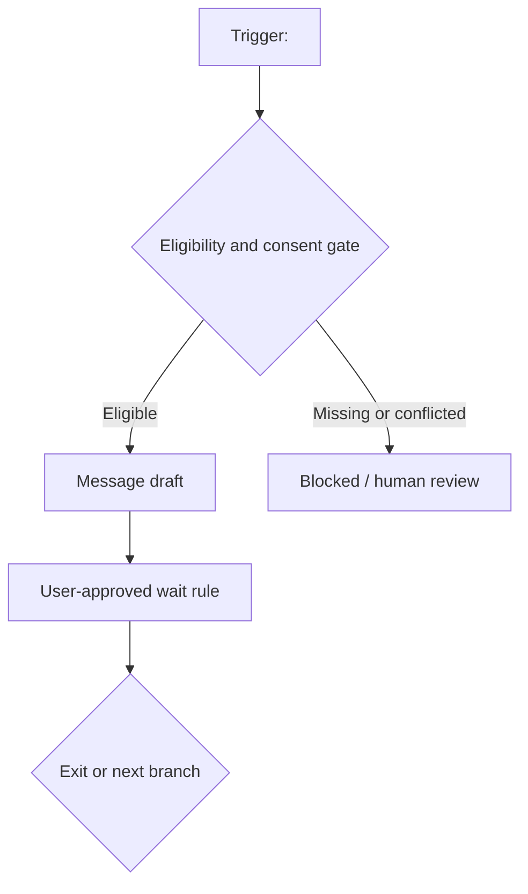

<!--
文件功能：提供邮件生命周期、permission、audience、流程节点、内容草稿与测量交接的正式模板。
职责边界：模板只承载待人工审核的静态设计，不表示名单已上传、ESP 已配置、邮件已排程或已发送。
重要关联：字段语义见 references/email-lifecycle-evidence-contract.md；生成前遵守上级 SKILL.md。
-->

# 邮件生命周期 Campaign 设计

## 1. 状态摘要

| 字段 | 值 |
|---|---|
| Campaign / Lifecycle ID |  |
| Marketplace / Locale |  |
| Audience Scope |  |
| Goal / Planning Period / Timezone |  |
| Owner / Reviewer |  |
| Generated At / Version |  |
| Result Status | `draft_for_review / blocked / out_of_scope` |
| Reason Codes | `[none]` |
| Campaign Status | `draft_for_review / not_created` |
| Send Status | `not_sent` |
| Schedule Status | `not_scheduled` |

## 2. Lifecycle 与 Audience

| Object ID | Type | Definition | Version | Source Evidence ID | Source Type | Source Locator | Applicable Scope | Temporal Scope | Estimation Status | Transformation Type | Currentness | Limitations |
|---|---|---|---|---|---|---|---|---|---|---|---|---|
|  | lifecycle / audience |  |  |  |  |  |  |  |  |  |  |  |

## 3. Consent / Suppression

| Permission Set ID | Source Evidence ID | Type | Audience / Purpose / Jurisdiction | Source Type | Source Locator | Temporal Scope | Estimation Status | Transformation Type | Updated / Verified | Valid Until | Coverage | Parent / Policy Evidence IDs | Status / Limitations |
|---|---|---|---|---|---|---|---|---|---|---|---|---|---|
|  |  | consent / suppression |  |  |  |  |  |  |  |  |  |  |  |

## 4. Audience 规则

| Agent Output ID | Audience Rule ID | Include | Exclude | Consent Requirement | Suppression Sets | Market / Locale | Missing Behavior | Parent Evidence IDs | Source Type | Temporal Scope | Estimation Status | Transformation Type |
|---|---|---|---|---|---|---|---|---|---|---|---|---|
|  |  |  |  |  |  |  | `exclude_and_block / route_for_review` |  | `agent` |  |  |  |

## 5. 流程图

该图只描述静态逻辑，不创建自动流程。

## 6. 流程节点

| Agent Output ID | Node ID | Type | Condition / Rule | Source Fields | Parent Evidence IDs | Source Type | Temporal Scope | Estimation Status | Transformation Type | Missing / Conflict Behavior | Next Node | Owner | Invalidation Trigger |
|---|---|---|---|---|---|---|---|---|---|---|---|---|---|
|  |  | trigger / branch / exclusion / wait / exit / message |  |  |  | `agent` |  |  |  |  |  |  |  |

## 7. 内容草稿

| Agent Output ID | Draft ID | Node / Lifecycle | Content Intent | Subject / Preheader | Body / CTA | Claim IDs | Asset Requirement | Promotion Brief | Policy Evidence | Parent Evidence IDs | Source Type | Temporal Scope | Estimation Status | Transformation Type | Send |
|---|---|---|---|---|---|---|---|---|---|---|---|---|---|---|---|
|  |  |  |  |  |  |  |  |  |  |  | `agent` |  |  |  | `not_sent` |

## 8. 声明证据

| Agent Output ID | Statement ID | Draft Location | Text | Claim Evidence | Parent Evidence IDs | Source Type | Temporal Scope | Estimation Status | Transformation Type | Support | Required Change |
|---|---|---|---|---|---|---|---|---|---|---|---|
|  |  |  |  |  |  | `agent` |  |  |  | `supported / conditional / unsupported / conflicted` |  |

## 9. 测量交接

| Agent Output ID | Handoff ID | Measurement Question | Event Label | Intervention ID | Desired Metric | Required Exposure / Outcome Fields | Analysis Scope | Parent Evidence IDs | Source Type | Temporal Scope | Estimation Status | Transformation Type | Owner |
|---|---|---|---|---|---|---|---|---|---|---|---|---|---|
|  |  |  |  |  |  |  |  |  | `agent` |  |  |  | 第 13 专家 |

## 10. Agent 派生记录

每个 audience rule、trigger、branch、exclusion、wait、exit、draft segment、email draft、claim map entry 和 measurement handoff 必须各占一行。

| Agent Output ID | Output Type | Campaign / Object ID | Parent Evidence IDs | Source Type | Temporal Scope | Estimation Status | Transformation Type | Transformation Summary | Rule Version | Uncertainty | Human Review |
|---|---|---|---|---|---|---|---|---|---|---|---|
|  |  |  |  | `agent` |  |  |  |  |  |  |  |

`temporal_scope`、`estimation_status` 和 `transformation_type` 必须使用 `email-lifecycle-evidence-contract.md` 派生 schema 的允许值；四轴不可合并。

## 11. 缺口与冲突

| Gap ID | Agent Output ID | Affected Object | Parent Evidence IDs | Source Type | Temporal Scope | Estimation Status | Transformation Type | Reason Code | Evidence State | Required Resolution | Owner | Campaign Effect |
|---|---|---|---|---|---|---|---|---|---|---|---|---|
|  |  |  |  | `agent` |  | `not_applicable` | `gap_classification` |  |  |  |  |  |

## 12. 人工审核

- [ ] lifecycle/audience 来源、版本和范围明确
- [ ] consent/suppression 已由第 09 或合格责任人提供当前证据
- [ ] 缺失/冲突不会推定 eligible
- [ ] wait/frequency/quiet period 均有用户或当前规则依据
- [ ] 每个节点和草稿 statement 有 parent Evidence
- [ ] 促销引用第 06 正式 brief
- [ ] 视觉需求交给第 04
- [ ] 测量问题交给第 13
- [ ] 正式输出不含原始邮箱、名单、凭据或不必要 PII
- [ ] 未调用 `email_send`、Web、shell 网络、ESP/CRM
- [ ] `send_status=not_sent` 且 `schedule_status=not_scheduled`

## 13. 未执行声明

本工作包没有收集或构造邮箱，没有修改 consent/suppression，没有上传名单，没有连接或配置 ESP，没有创建后台自动化，也没有排程或发送任何邮件。
